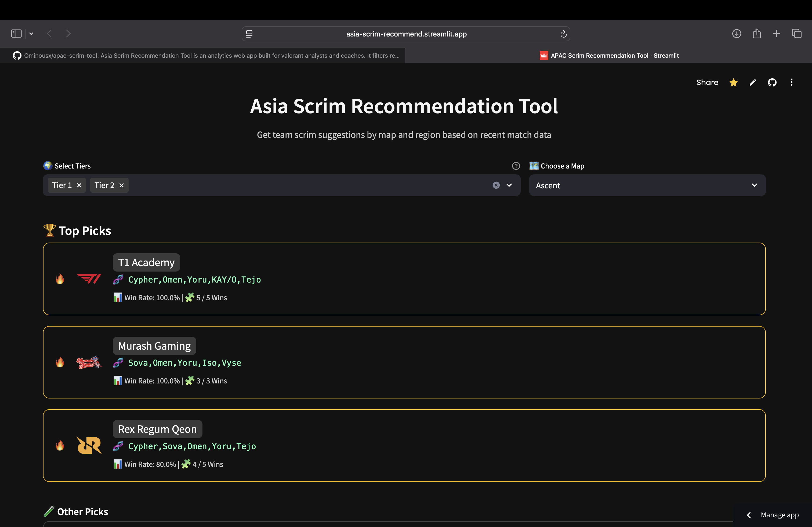

# 🌏 APAC Scrim Recommendation Tool

A sleek Streamlit web app that helps analysts and teams discover the **best-performing scrim opponents by map and sub-region** in the Asian Valorant scene — powered by real VLR.gg data.



---

## 📊 What It Does

This tool lets you:
- 🔢 **Filter by Tier 1 / Tier 2 leagues**
- 🗺️ **Choose a specific Valorant map**
- 🔍 See the **top 3 teams** based on win rate, with:
  - Streak indicators 🔥
  - Most common comps 🧬
  - W/L stats 📈
- 💡 Filter logic is based on recent match data from [vlr.gg](https://vlr.gg)

---

## ✨ Features

- ⚡ **Weekly Data Fetching** from [vlr.gg](https://vlr.gg)
- 🔥 **Streak highlighting** for in-form teams
- 🎨 **Team logos and composition badges**
- 📅 **Last updated date** clearly displayed

---

## 🚀 Run Locally

Clone this repo:

```bash
git clone https://github.com/Ominousx/apac-scrim-tool.git
cd apac-scrim-tool
```

Install dependencies:

```bash
pip install -r requirements.txt
```

Run the app:

```bash
streamlit run app.py
```

---

## 🧰 Tech Stack

- **Frontend**: [Streamlit](https://streamlit.io)
- **Styling**: Custom CSS
- **Hosting**: Deployed via Streamlit Cloud

---

## 📂 File Structure

```bash
📁 apac-scrim-tool
├── app.py
├── .streamlit/
│   └── config.toml
├── maps/
│   ├── ascent.png
│   ├── murash_logo.png
│   └── ...
├── screenshot.png
├── requirements.txt
└── README.md
```

---

## ✍️ Credits

Built by [@Ominous](https://twitter.com/_SushantJha) 🎮

For feedback, feature requests, or contributions, feel free to:
- Open an issue
- Fork the repo
- Or connect on Twitter

Data from [vlr.gg](https://vlr.gg)
